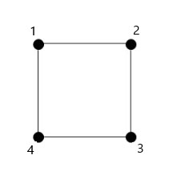

# ProjetoFinal
Execução do Projeto Final para a disciplina de Linguagens de Programação

Tema: Teorema de Euler

Membros do Grupo: 

Diogo Proença nº 190100156 

Pedro Lourenço nº 190100117

"Como introduzir um grafo"
Utilizando o seguinte grafo como exemplo: 

A ligação de um ponto aos seus vértices seria   1->[2,4]   2->[1,3]   3->[2.4]   4->[3,1]  
Sendo o input no programa
[[2,4],[1,3],[2.4],[3,1]]